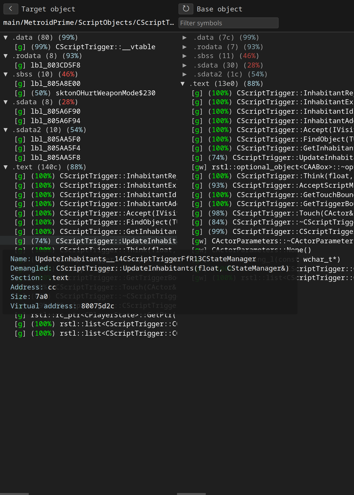
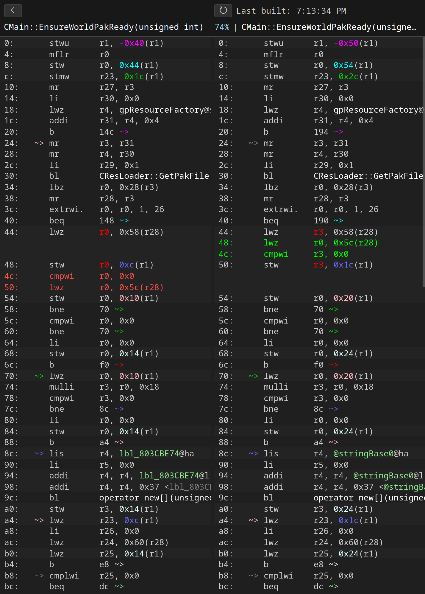

# objdiff-web

Web interface for [objdiff](https://github.com/encounter/objdiff): a local diffing tool for decompilation projects.

This project contains both a standalone web interface and a [Visual Studio Code extension](https://marketplace.visualstudio.com/items?itemName=decomp-dev.objdiff).

<p align="center">
  
  
</p>

## How It Works

The object parsing and diffing is powered by [objdiff-core](https://github.com/encounter/objdiff/tree/main/objdiff-core), compiled into a [WebAssembly Component](https://component-model.bytecodealliance.org/). The [API](https://github.com/encounter/objdiff/blob/main/objdiff-wasm/wit/objdiff.wit) is defined using [WIT](https://component-model.bytecodealliance.org/design/wit.html).

Performance is a priority, so the web stack is deliberately minimal. The application loads from scratch in under 200ms and diffs large object files in 20ms. The build system, powered by [Rsbuild](https://rsbuild.dev/), produces a production build in under 300ms, with near-instantaneous live reloading during development.

## Setup

- Install dependencies:

  ```bash
  pnpm install
  ```

## Run Dev Server

- Start the dev server using:

  ```bash
  pnpm web:dev
  ```

- Visit [http://localhost:3000/](http://localhost:3000/). (The port may change if it is already in use.)

## Run Extension

- Open the project in Visual Studio Code.

- Start the extension build using `Ctrl+Shift+B` or by running:

  ```bash
  pnpm extension:dev
  ```

- Run the extension in debug mode using `F5`.
